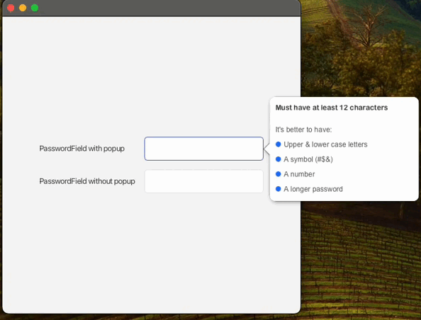

# FXtend - Extending JavaFX Controls

[](https://central.sonatype.com/artifact/io.github.alialkubaisi/fxtend/1.0.2)


FXtend is an open-source JavaFX library that aims to provide additional, new, or improved controls for JavaFX
applications. The library is designed to be easy to use and integrate seamlessly into existing JavaFX projects.

## Features

- 🚀 New JavaFX controls that extend the standard set of controls.
- 🔄 Improved versions of existing JavaFX controls with added functionalities.
- 🎨 Custom styles and themes for a unique look and feel.

## Installation

FXtend can be included in your JavaFX project as a dependency using Maven or Gradle.

### Maven

```xml

<dependency>
    <groupId>io.github.alialkubaisi</groupId>
    <artifactId>fxtend</artifactId>
    <version>1.0.2</version>
</dependency>
```

### Gradle

```
implementation 'io.github.alialkubaisi:fxtend:1.0.2'
```

## Controls

### SecurePasswordField

The `SecurePasswordField` control in FXtend is an enhanced version of the default JavaFX `SecurePasswordField`. It
includes the following features:

- **Eye Icon to Show/Hide Password:** Users can toggle the visibility of the password by clicking an eye icon.
  
  
- **Password Strength Validation:** An optional popup can display the strength of the password as the user types.
  

### Usage

To use SecurePasswordField in your application, you can instantiate it with optional parameters to enable strength
validation and set a minimum length:

```java
// Create a SecurePasswordField with default settings
SecurePasswordField passwordField = new SecurePasswordField();

// Create a SecurePasswordField with password strength validation enabled
SecurePasswordField validationPasswordField = new SecurePasswordField(true, 12);
```

### AutoCompleteField

The `AutoCompleteField` control in FXtend provides a text field with autocomplete functionality. It includes
a `searchMode` parameter to determine whether suggestions should match based on "contains", "start with", or "end
with".<br />

#### Usage

To use `AutoCompleteField` in your application, you can instantiate it with a list of suggestions and optionally specify
the search mode:

```java
// suggestions is a list of strings, with default search mode (contains)
AutoCompleteField autoCompleteFieldContains = new AutoCompleteField(suggestions);
// Create AutoCompleteField with "contains" search mode
AutoCompleteField autoCompleteFieldContains = new AutoCompleteField(buildSuggestions(), SearchMode.CONTAINS);
```


### ChatView

The `ChatView` control provides an interactive chat interface similar to popular messaging applications. It includes
features such as:

- **Send and Receive Messages:** Easily send and receive messages with built-in handling for both incoming and outgoing
  messages.
- **Customizable Styles:** Choose from several pre-defined styles (`DEFAULT`, `MODERN`, `DARK`) or create your own.
- **Optional Logo for Received Messages:** Display a logo image on the received message bubbles.
- **Timestamp Display:** Automatically display timestamps for each message, enhancing the chat experience.
- **Message Status Indicators:** Display message statuses like "Sent", "Received", or "Read" with visual indicators.

#### Usage

You can instantiate the `ChatView` in several ways, depending on your requirements:

```java
ChatView chatView = new ChatView(); // Apply default style without adding header
ChatView chatViewWithTitle = new ChatView("title"); // This will add a header in the chat view
ChatView chatViewModern = new ChatView(ChatView.Style.MODERN); // Apply modern style without adding header
ChatView chatViewDarkWithTitle = new ChatView("title", ChatView.Style.DARK); // Apply dark style with title as header
```

Messages can be sent using the `TextField` within the `ChatView` or programmatically using the `sendMessage` method. To
receive messages, use the `receiveMessage` method.

```java
ChatView chatView = new ChatView();
chatView.sendMessage("Hello, this is a sent message!");
chatView.receiveMessage("Hi! This is a received message.",new Image("/path/to/logo.png")); // Received message with optional logo
```


### TimelineView

The `TimelineView` is a versatile and customizable JavaFX control for displaying a chronological list of entries with 
flexible configuration options. It provides an intuitive way to visualize historical events, project changes, or user activities.

#### Key Features

- **Flexible Entry Rendering:** Customize how timeline entries are displayed using a TimelineCellFactory
- **Automatic Day Grouping:** Optional date-based grouping of entries
- **Expandable History:** Configurable initial history limit with show more/less functionality
- **Internationalization Support:** Built-in support for translated text
- **Vertical Timeline Visualization:** Entries are displayed along a vertical line with interactive knots

#### Usage

To use `TimelineView` in your JavaFX application, instantiate it with a list of `TimelineEntry` objects:

```java
// Sample timeline entries
List<TimelineEntry> events = List.of(
    new TimelineEntry(TimelineTextConstants.CREATE, "Alice", "Created the project repository.", new Date()),
    new TimelineEntry(TimelineTextConstants.UPDATE, "Bob", "Updated project requirements.", new Date())
);

// Create a TimelineView with default settings
TimelineView<TimelineEntry> timeline = new TimelineView<>("Project History", events);
```
##### Custom Cell Rendering
For advanced customization, you can define a TimelineCellFactory to control how each entry is displayed:

```java
TimelineCellFactory<TimelineEntry> cellFactory = (event, isNewDay) -> {
    GridPane cell = new GridPane();
    cell.setHgap(10);

    Label actionLabel = new Label(event.action().getTranslatedMessage());
    Label userLabel = new Label(event.username());
    Label dateLabel = new Label(new SimpleDateFormat("MMM dd, yyyy HH:mm").format(event.date()));

    cell.add(actionLabel, 0, 0);
    cell.add(userLabel, 1, 0);
    cell.add(dateLabel, 2, 0);

    return cell;
};

// Create a TimelineView with custom rendering
TimelineView<TimelineEntry> customTimeline = new TimelineView<>("Custom History", events, cellFactory, TimelineEntry::date);
```


### InformationDecorator
The `InformationDecorator` control in FXtend is a versatile decorator component that enhances any JavaFX node by adding 
an information button with a popover. It wraps your target control and automatically displays context-sensitive help 
when the button is clicked.

#### Key Features

- **Decorator Pattern:** Wrap any JavaFX node to provide on-demand help.
- **Customizable Button Position:** Place the info button on the left or right side (using Pos.CENTER_LEFT or Pos.CENTER_RIGHT).
- **Stylish Popover:** A customizable popover displays the provided help text.
- **Simplified Integration:** Use the InformationFactory for one-line decoration.
- **Thread-Safe UI Updates:** Ensures popover toggling is executed on the JavaFX Application Thread.

#### Usage
Wrap your node with the information decorator using the factory methods:

```java 
// Decorate a TextField with an information button (default position: right)
InformationDecorator decoratedField = InformationFactory.addInfoTo(myTextField, "Enter your email address for account recovery.");

// Decorate a TextField with the information button on the left
InformationDecorator decoratedFieldLeft = InformationFactory.addInfoTo(myTextField, "Enter your full name as shown on official documents.", Pos.CENTER_LEFT);
```

